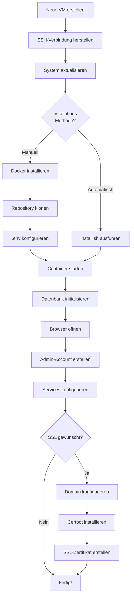
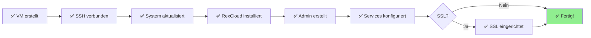

# RexCloud - Visuelle Installations-Anleitung

Diese Anleitung zeigt Ihnen visuell jeden Schritt der RexCloud-Installation mit erwarteten Ausgaben und Diagrammen.

## 📋 Inhaltsverzeichnis

1. [Installations-Übersicht](#installations-übersicht)
2. [Schritt 1: VM vorbereiten](#schritt-1-vm-vorbereiten)
3. [Schritt 2: Installation starten](#schritt-2-installation-starten)
4. [Schritt 3: Ersten Admin erstellen](#schritt-3-ersten-admin-erstellen)
5. [Schritt 4: Services konfigurieren](#schritt-4-services-konfigurieren)
6. [Schritt 5: SSL einrichten](#schritt-5-ssl-einrichten-optional)

---

## Installations-Übersicht



---

## Schritt 1: VM vorbereiten

### 1.1 VM erstellen

**Bei Hetzner Cloud Console:**

```
┌─────────────────────────────────────────────────┐
│ Hetzner Cloud Console                           │
├─────────────────────────────────────────────────┤
│                                                 │
│  Neuen Server erstellen                         │
│                                                 │
│  Location:  [Nürnberg ▼]                        │
│  Image:     [Ubuntu 22.04 ▼]                    │
│  Type:      [ ] CX11 (1 vCPU, 2GB RAM)         │
│             [x] CX21 (2 vCPU, 4GB RAM) ← Wählen │
│             [ ] CX31 (2 vCPU, 8GB RAM)         │
│                                                 │
│  Name:      rexcloud                            │
│                                                 │
│  SSH Keys:  [x] Mein SSH-Key                    │
│                                                 │
│  [Server erstellen]                             │
│                                                 │
└─────────────────────────────────────────────────┘
```

**Erwartete Ausgabe nach Erstellung:**

```
┌─────────────────────────────────────────────────┐
│ Server erfolgreich erstellt!                    │
├─────────────────────────────────────────────────┤
│ Name:     rexcloud                              │
│ IP:       xxx.xxx.xxx.xxx                       │
│ Status:   ● Running                             │
└─────────────────────────────────────────────────┘
```

### 1.2 SSH-Verbindung

**Terminal öffnen und verbinden:**

```bash
ssh root@xxx.xxx.xxx.xxx
```

**Erwartete Ausgabe:**

```
The authenticity of host 'xxx.xxx.xxx.xxx (xxx.xxx.xxx.xxx)' can't be established.
ED25519 key fingerprint is SHA256:xxxxxxxxxxxxxxxxxxxxxxxxxxxxxxxxxxxxx.
Are you sure you want to continue connecting (yes/no/[fingerprint])? yes

Warning: Permanently added 'xxx.xxx.xxx.xxx' (ED25519) to the list of known hosts.

Welcome to Ubuntu 22.04.3 LTS (GNU/Linux 5.15.0-91-generic x86_64)

 * Documentation:  https://help.ubuntu.com
 * Management:     https://landscape.canonical.com
 * Support:        https://ubuntu.com/advantage

root@rexcloud:~#
```

### 1.3 System aktualisieren

```bash
apt update && apt upgrade -y
```

**Erwartete Ausgabe:**

```
Hit:1 http://archive.ubuntu.com/ubuntu jammy InRelease
Get:2 http://archive.ubuntu.com/ubuntu jammy-updates InRelease [119 kB]
Get:3 http://archive.ubuntu.com/ubuntu jammy-backports InRelease [109 kB]
Get:4 http://security.ubuntu.com/ubuntu jammy-security InRelease [110 kB]

Fetched 15.2 MB in 3s (5,234 kB/s)
Reading package lists... Done

Building dependency tree... Done
Reading state information... Done
45 packages can be upgraded. Run 'apt list --upgradable' to see them.

Reading package lists... Done
Building dependency tree... Done
Reading state information... Done

Calculating upgrade... Done
The following packages will be upgraded:
  base-files bind9-dnsutils bind9-host bind9-libs curl
  [... weitere Pakete ...]

45 upgraded, 0 newly installed, 0 to remove and 0 not upgraded.
Need to get 67.8 MB of archives.
After this operation, 123 kB of additional disk space will be used.

[████████████████████████████████████████] 100%

Setting up base-files (12ubuntu4.5) ...
Setting up curl (7.81.0-1ubuntu1.15) ...
[... weitere Installationen ...]

Done!
```

---

## Schritt 2: Installation starten

### 2.1 Repository klonen

```bash
git clone https://github.com/yourusername/rexcloud.git
cd rexcloud
```

**Erwartete Ausgabe:**

```
Cloning into 'rexcloud'...
remote: Enumerating objects: 487, done.
remote: Counting objects: 100% (487/487), done.
remote: Compressing objects: 100% (324/324), done.
remote: Total 487 (delta 145), reused 456 (delta 114), pack-reused 0
Receiving objects: 100% (487/487), 2.45 MiB | 8.32 MiB/s, done.
Resolving deltas: 100% (145/145), done.

root@rexcloud:~/rexcloud#
```

### 2.2 Automatische Installation

```bash
chmod +x install.sh
./install.sh
```

**Erwartete Ausgabe (Auszug):**

```
🚀 RexCloud Installation Script
================================

📋 Checking system requirements...
✓ Running as user: root
✓ User has sudo privileges
✓ Operating System: Ubuntu 22.04.3 LTS

━━━━━━━━━━━━━━━━━━━━━━━━━━━━━━━━━━━━━━━━━━

📦 Installing system packages...
[████████████████████████████████████████] 100%
✅ System packages installed

🐳 Installing Docker...
[████████████████████████████████████████] 100%
✅ Docker installed successfully
✅ User added to docker group

📥 Cloning RexCloud repository...
Repository already exists at /root/rexcloud
✅ Using existing repository

🔐 Generating secure credentials...

━━━━━━━━━━━━━━━━━━━━━━━━━━━━━━━━━━━━━━━━━━
⚠️  IMPORTANT: Save these credentials securely!
━━━━━━━━━━━━━━━━━━━━━━━━━━━━━━━━━━━━━━━━━━

Database Password: Kx9mP2nL8vQ4rT6wY1zH5jN3bC7fG0s
JWT Secret:        aB3dE6fG8hJ0kL2mN5pQ7rS9tV1wX4yZ6aC8dF0gH2jK5lM7nP9qR
Encryption Key:    Hs5Gt8Yr2Wp9Lm4Nq7Xt3Cv6Bz1Fk0Jd

━━━━━━━━━━━━━━━━━━━━━━━━━━━━━━━━━━━━━━━━━━

✅ .env file created

🏗️  Building Docker images...
[+] Building 125.3s (24/24) FINISHED

✅ Docker images built successfully

🚀 Starting containers...
[+] Running 3/3
 ✓ Container rexcloud-db       Started
 ✓ Container rexcloud-backend  Started
 ✓ Container rexcloud-frontend Started

⏳ Waiting for database to initialize...
[████████████████████████████████████████] 15s

🔄 Running database migrations...
✅ Database initialized successfully

━━━━━━━━━━━━━━━━━━━━━━━━━━━━━━━━━━━━━━━━━━
✨ Installation Complete!
━━━━━━━━━━━━━━━━━━━━━━━━━━━━━━━━━━━━━━━━━━

🌐 Access your RexCloud instance at:
   http://xxx.xxx.xxx.xxx

📊 Container Status:
NAME                    STATUS              PORTS
rexcloud-frontend       Up 1 minute         0.0.0.0:80->80/tcp
rexcloud-backend        Up 1 minute         3001/tcp
rexcloud-db             Up 1 minute         5432/tcp

━━━━━━━━━━━━━━━━━━━━━━━━━━━━━━━━━━━━━━━━━━
```

---

## Schritt 3: Ersten Admin erstellen

### 3.1 Browser öffnen

**URL eingeben:**
```
http://xxx.xxx.xxx.xxx
```

**Erwartete Ansicht - Login-Seite:**

```
┌─────────────────────────────────────────────────────────────┐
│                                                             │
│                    ┌─────────────────┐                      │
│                    │   RexCloud      │                      │
│                    │   [Logo]        │                      │
│                    └─────────────────┘                      │
│                                                             │
│               Infrastructure Management                     │
│                                                             │
│     ┌─────────────────────────────────────────────┐        │
│     │  Anmelden                                   │        │
│     ├─────────────────────────────────────────────┤        │
│     │                                             │        │
│     │  E-Mail oder Benutzername                   │        │
│     │  ┌───────────────────────────────────────┐ │        │
│     │  │                                       │ │        │
│     │  └───────────────────────────────────────┘ │        │
│     │                                             │        │
│     │  Passwort                                   │        │
│     │  ┌───────────────────────────────────────┐ │        │
│     │  │ ●●●●●●●●                              │ │        │
│     │  └───────────────────────────────────────┘ │        │
│     │                                             │        │
│     │  [ Anmelden ]                               │        │
│     │                                             │        │
│     │  Noch kein Konto? → Registrieren           │        │
│     │                                             │        │
│     └─────────────────────────────────────────────┘        │
│                                                             │
└─────────────────────────────────────────────────────────────┘
```

### 3.2 Zur Registrierung wechseln

**Auf "Registrieren" klicken:**

```
┌─────────────────────────────────────────────────────────────┐
│                                                             │
│                    ┌─────────────────┐                      │
│                    │   RexCloud      │                      │
│                    │   [Logo]        │                      │
│                    └─────────────────┘                      │
│                                                             │
│               Account erstellen                             │
│                                                             │
│     ┌─────────────────────────────────────────────┐        │
│     │  Registrieren                               │        │
│     ├─────────────────────────────────────────────┤        │
│     │                                             │        │
│     │  Benutzername                               │        │
│     │  ┌───────────────────────────────────────┐ │        │
│     │  │ admin                                 │ │        │
│     │  └───────────────────────────────────────┘ │        │
│     │                                             │        │
│     │  E-Mail                                     │        │
│     │  ┌───────────────────────────────────────┐ │        │
│     │  │ admin@example.com                     │ │        │
│     │  └───────────────────────────────────────┘ │        │
│     │                                             │        │
│     │  Passwort                                   │        │
│     │  ┌───────────────────────────────────────┐ │        │
│     │  │ ●●●●●●●●●●●●                          │ │        │
│     │  └───────────────────────────────────────┘ │        │
│     │                                             │        │
│     │  ⚠️  Der erste Benutzer wird Admin!        │        │
│     │                                             │        │
│     │  [ Registrieren ]                           │        │
│     │                                             │        │
│     │  Bereits registriert? → Anmelden           │        │
│     │                                             │        │
│     └─────────────────────────────────────────────┘        │
│                                                             │
└─────────────────────────────────────────────────────────────┘
```

### 3.3 Nach erfolgreicher Registrierung

**Erwartete Ansicht - Dashboard:**

```
┌──────────────────────────────────────────────────────────────────┐
│ ☰  RexCloud                    🔔  👤 Admin           ☀️/🌙      │
├──────────────────────────────────────────────────────────────────┤
│                                                                  │
│  📊 Dashboard                                                    │
│                                                                  │
│  ┌─────────────────┐  ┌─────────────────┐  ┌─────────────────┐ │
│  │ 💻 Proxmox      │  │ ☁️ Hetzner     │  │ 🌐 DNS          │ │
│  │                 │  │                 │  │                 │ │
│  │ 0 Server        │  │ 0 Server        │  │ 0 Zonen         │ │
│  │ 0 VMs           │  │                 │  │                 │ │
│  │ 0 Container     │  │                 │  │                 │ │
│  │                 │  │                 │  │                 │ │
│  │ [Konfigurieren] │  │ [Konfigurieren] │  │ [Konfigurieren] │ │
│  └─────────────────┘  └─────────────────┘  └─────────────────┘ │
│                                                                  │
│  ┌─────────────────┐  ┌─────────────────┐  ┌─────────────────┐ │
│  │ 📧 Mail         │  │ 🌍 Websites     │  │ 👥 Kunden       │ │
│  │                 │  │                 │  │                 │ │
│  │ 0 Server        │  │ 0 Server        │  │ 0 Kunden        │ │
│  │ 0 Mailboxen     │  │ 0 Websites      │  │                 │ │
│  │                 │  │                 │  │                 │ │
│  │ [Konfigurieren] │  │ [Konfigurieren] │  │ [Hinzufügen]    │ │
│  └─────────────────┘  └─────────────────┘  └─────────────────┘ │
│                                                                  │
└──────────────────────────────────────────────────────────────────┘
│                                                                  │
│ ├─ 📊 Dashboard                                                 │
│ ├─ 💻 Proxmox                                                   │
│ ├─ 🌐 DNS                                                       │
│ ├─ 📧 Mail                                                      │
│ ├─ 🌍 Websites                                                  │
│ ├─ ☁️ Hetzner                                                  │
│ ├─ 📜 Scripts                                                   │
│ ├─ 👥 Kunden                                                    │
│ └─ ⚙️ Einstellungen                                            │
│                                                                  │
└──────────────────────────────────────────────────────────────────┘
```

---

## Schritt 4: Services konfigurieren

### 4.1 Proxmox Server hinzufügen

**Navigation: Einstellungen → Proxmox Server**

```
┌──────────────────────────────────────────────────────────────────┐
│ ⚙️ Einstellungen                                                 │
├──────────────────────────────────────────────────────────────────┤
│                                                                  │
│  [Proxmox Server] [Mail Server] [Plesk Server] [DNS Provider]   │
│  ──────────────                                                  │
│                                                                  │
│  ┌────────────────────────────────────────────────────────────┐ │
│  │ Proxmox Server hinzufügen                              [+] │ │
│  ├────────────────────────────────────────────────────────────┤ │
│  │                                                            │ │
│  │  Name                                                      │ │
│  │  ┌──────────────────────────────────────────────────────┐ │ │
│  │  │ Proxmox-Node-1                                       │ │ │
│  │  └──────────────────────────────────────────────────────┘ │ │
│  │                                                            │ │
│  │  Host                                                      │ │
│  │  ┌──────────────────────────────────────────────────────┐ │ │
│  │  │ https://proxmox.example.com                          │ │ │
│  │  └──────────────────────────────────────────────────────┘ │ │
│  │                                                            │ │
│  │  Port                                                      │ │
│  │  ┌──────────────────────────────────────────────────────┐ │ │
│  │  │ 8006                                                 │ │ │
│  │  └──────────────────────────────────────────────────────┘ │ │
│  │                                                            │ │
│  │  Benutzername                                              │ │
│  │  ┌──────────────────────────────────────────────────────┐ │ │
│  │  │ root@pam                                             │ │ │
│  │  └──────────────────────────────────────────────────────┘ │ │
│  │                                                            │ │
│  │  Passwort                                                  │ │
│  │  ┌──────────────────────────────────────────────────────┐ │ │
│  │  │ ●●●●●●●●●●●●                                         │ │ │
│  │  └──────────────────────────────────────────────────────┘ │ │
│  │                                                            │ │
│  │  [ Server hinzufügen ]                                     │ │
│  │                                                            │ │
│  └────────────────────────────────────────────────────────────┘ │
│                                                                  │
│  Konfigurierte Proxmox Server                                   │
│  ┌────────────────────────────────────────────────────────────┐ │
│  │                                                            │ │
│  │  Keine Server konfiguriert                                │ │
│  │                                                            │ │
│  └────────────────────────────────────────────────────────────┘ │
│                                                                  │
└──────────────────────────────────────────────────────────────────┘
```

**Nach dem Hinzufügen:**

```
┌──────────────────────────────────────────────────────────────────┐
│  Konfigurierte Proxmox Server                                   │
│  ┌────────────────────────────────────────────────────────────┐ │
│  │ ┌──────────────────────────────────────────────┐          │ │
│  │ │ Proxmox-Node-1                         [🗑️] │          │ │
│  │ │ https://proxmox.example.com:8006             │          │ │
│  │ │ ● Verbunden                                  │          │ │
│  │ └──────────────────────────────────────────────┘          │ │
│  └────────────────────────────────────────────────────────────┘ │
└──────────────────────────────────────────────────────────────────┘
```

### 4.2 DNS Provider konfigurieren

**Navigation: Einstellungen → DNS Provider**

```
┌──────────────────────────────────────────────────────────────────┐
│  [Proxmox Server] [Mail Server] [Plesk Server] [DNS Provider]   │
│                                                  ──────────────   │
│                                                                  │
│  ┌────────────────────────────────────────────────────────────┐ │
│  │ DNS Provider Konfiguration                                 │ │
│  ├────────────────────────────────────────────────────────────┤ │
│  │                                                            │ │
│  │  Provider auswählen:                                       │ │
│  │  ● Hetzner DNS  ○ AutoDNS                                 │ │
│  │                                                            │ │
│  │  Hetzner DNS API Key                                       │ │
│  │  ┌──────────────────────────────────────────────────────┐ │ │
│  │  │ xxxxxxxxxxxxxxxxxxxxxxxxxxxxxxxxxxxx                 │ │ │
│  │  └──────────────────────────────────────────────────────┘ │ │
│  │                                                            │ │
│  │  [ Speichern ]                                             │ │
│  │                                                            │ │
│  │  ℹ️ API Key erhalten: https://dns.hetzner.com             │ │
│  │     Account → API Tokens → Token erstellen                │ │
│  │                                                            │ │
│  └────────────────────────────────────────────────────────────┘ │
└──────────────────────────────────────────────────────────────────┘
```

### 4.3 System-Updates Ansicht

**Navigation: Einstellungen → System-Updates**

```
┌──────────────────────────────────────────────────────────────────┐
│  [...] [DNS Provider] [System-Updates]                          │
│                        ───────────────                           │
│                                                                  │
│  ┌────────────────────────────────────────────────────────────┐ │
│  │ 🏷️ System-Updates                                          │ │
│  ├────────────────────────────────────────────────────────────┤ │
│  │                                                            │ │
│  │  Aktuelle Version                                          │ │
│  │  ┌──────────────────────────────────────────────────────┐ │ │
│  │  │ v1.0.0                              [Release] Badge   │ │ │
│  │  │ Commit: abc1234                                      │ │ │
│  │  └──────────────────────────────────────────────────────┘ │ │
│  │                                                            │ │
│  │  ✅ System ist aktuell                                    │ │
│  │  Commit: abc1234                                           │ │
│  │                                                            │ │
│  │  [ 🔄 Nach Updates suchen ]  [ 📝 Changelog ]             │ │
│  │  [ 🏷️ Versionen ]                                         │ │
│  │                                                            │ │
│  │  Updates werden automatisch aus dem Git-Repository        │ │
│  │  abgerufen. Die Anwendung wird während Updates neu        │ │
│  │  gestartet.                                                │ │
│  │                                                            │ │
│  └────────────────────────────────────────────────────────────┘ │
└──────────────────────────────────────────────────────────────────┘
```

---

## Schritt 5: SSL einrichten (Optional)

### 5.1 Domain-DNS konfigurieren

**Bei Ihrem DNS-Provider (z.B. Hetzner DNS):**

```
┌─────────────────────────────────────────────────┐
│ DNS Records für: example.com                    │
├─────────────────────────────────────────────────┤
│                                                 │
│  Type    Name         Value            TTL     │
│  ──────────────────────────────────────────     │
│  A       rexcloud     xxx.xxx.xxx.xxx   3600   │
│  A       @            xxx.xxx.xxx.xxx   3600   │
│                                                 │
│  [ + Record hinzufügen ]                        │
│                                                 │
└─────────────────────────────────────────────────┘
```

### 5.2 Certbot installieren

```bash
apt install -y certbot python3-certbot-nginx nginx
```

**Erwartete Ausgabe:**

```
Reading package lists... Done
Building dependency tree... Done
Reading state information... Done

The following NEW packages will be installed:
  certbot nginx python3-certbot-nginx

Setting up nginx (1.18.0-6ubuntu14.3) ...
Setting up certbot (1.21.0-1ubuntu0.1) ...
Created symlink /etc/systemd/system/timers.target.wants/certbot.timer
Setting up python3-certbot-nginx (1.21.0-1) ...

✅ Certbot installed successfully
```

### 5.3 SSL-Zertifikat erstellen

```bash
certbot --nginx -d rexcloud.example.com
```

**Interaktive Ausgabe:**

```
Saving debug log to /var/log/letsencrypt/letsencrypt.log

Enter email address (used for urgent renewal and security notices)
 (Enter 'c' to cancel): admin@example.com

- - - - - - - - - - - - - - - - - - - - - - - - - - - - - - - - - - - -
Please read the Terms of Service at
https://letsencrypt.org/documents/LE-SA-v1.3-September-21-2022.pdf
- - - - - - - - - - - - - - - - - - - - - - - - - - - - - - - - - - - -
(A)gree/(C)ancel: A

- - - - - - - - - - - - - - - - - - - - - - - - - - - - - - - - - - - -
Would you be willing to share your email address with the Electronic
Frontier Foundation?
- - - - - - - - - - - - - - - - - - - - - - - - - - - - - - - - - - - -
(Y)es/(N)o: N

Requesting a certificate for rexcloud.example.com

Successfully received certificate.
Certificate is saved at: /etc/letsencrypt/live/rexcloud.example.com/fullchain.pem
Key is saved at:         /etc/letsencrypt/live/rexcloud.example.com/privkey.pem
This certificate expires on 2024-04-15.
These files will be updated when the certificate renews.
Certbot has set up a scheduled task to automatically renew this
certificate in the background.

Deploying certificate
Successfully deployed certificate for rexcloud.example.com to /etc/nginx/sites-enabled/rexcloud
Congratulations! You have successfully enabled HTTPS on https://rexcloud.example.com

- - - - - - - - - - - - - - - - - - - - - - - - - - - - - - - - - - - -
If you like Certbot, please consider supporting our work by:
 * Donating to ISRG / Let's Encrypt:   https://letsencrypt.org/donate
 * Donating to EFF:                    https://eff.org/donate-le
- - - - - - - - - - - - - - - - - - - - - - - - - - - - - - - - - - - -

✅ SSL certificate successfully created!
```

### 5.4 HTTPS-Zugriff testen

**Browser öffnen:**
```
https://rexcloud.example.com
```

**Erwartete Ansicht:**

```
┌─────────────────────────────────────────────────┐
│ 🔒 Verbindung ist sicher                        │
├─────────────────────────────────────────────────┤
│                                                 │
│  https://rexcloud.example.com                   │
│                                                 │
│  Zertifikat gültig bis: 15.04.2024              │
│  Ausgestellt von: Let's Encrypt                 │
│                                                 │
└─────────────────────────────────────────────────┘
```

---

## Zusammenfassung - Installation erfolgreich!



## Nächste Schritte

1. ✅ **Proxmox-Server** hinzufügen und VMs/Container verwalten
2. ✅ **DNS-Zonen** erstellen und verwalten
3. ✅ **Mail-Server** konfigurieren
4. ✅ **Plesk-Websites** verwalten
5. ✅ **Hetzner Cloud** Server verwalten
6. ✅ **Kunden** anlegen und zuordnen
7. ✅ **Helper-Scripts** ausführen
8. ✅ **Backups** einrichten
9. ✅ **Updates** regelmäßig durchführen

---

## Häufige Fehler und Lösungen

### Fehler 1: Container starten nicht

**Symptom im Terminal:**
```
ERROR: for rexcloud-backend  Cannot start service backend: ...
ERROR: Encountered errors while bringing up the project.
```

**Lösung:**
```bash
# Logs prüfen
docker-compose logs backend

# Container neu starten
docker-compose down
docker-compose up -d
```

### Fehler 2: 502 Bad Gateway

**Symptom im Browser:**
```
┌─────────────────────────────────────────┐
│ 502 Bad Gateway                         │
│                                         │
│ nginx/1.18.0 (Ubuntu)                   │
└─────────────────────────────────────────┘
```

**Lösung:**
```bash
# Backend-Status prüfen
docker-compose ps backend

# Neu starten falls gestoppt
docker-compose restart backend
```

### Fehler 3: Login schlägt fehl

**Symptom im Browser:**
```
┌─────────────────────────────────────────┐
│ ❌ Anmeldung fehlgeschlagen            │
│                                         │
│ Benutzername oder Passwort falsch       │
└─────────────────────────────────────────┘
```

**Lösung:**
```bash
# Datenbank prüfen
docker-compose exec postgres psql -U rexcloud -d rexcloud -c "SELECT username, email FROM users;"

# Neuen Admin erstellen falls nötig
docker-compose restart backend
# Dann neu registrieren
```

---

**🎉 Glückwunsch! RexCloud ist jetzt einsatzbereit!**

Für weitere Hilfe siehe:
- [DEPLOYMENT.md](DEPLOYMENT.md) - Detaillierte Deployment-Anleitung
- [README.md](README.md) - Allgemeine Dokumentation
- [TROUBLESHOOTING.md](TROUBLESHOOTING.md) - Fehlerbehebung
